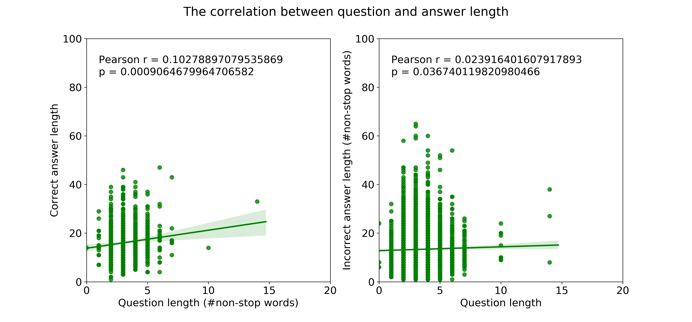
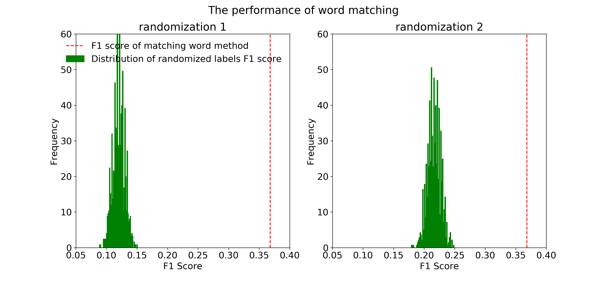

# ZD Challenge

The Challenge

This is a part of the email that I got with information about the test and data:
> ...We've built you a challenge similar to the type of problems you will probably work on if you get an offer from us. We do this so we can understand what working with you will be like, but also so you get a better idea of what it's like to work here before going through a full interview process.
> 
> **The challenge**
>
> We've got a good amount of data about how customers interact with businesses. We think there is a huge amount of knowledge hidden inside this data that could potentially lead to better customer experiences.
> Much of the data we work with is textual. I’ve included a tab-separated data file of question/answer pairs over a wide variety of topics. The data does provides labels but be creative, show us something interesting.
> We'd like you to play with this data. Build a model and generate a visualisation. When you are done send us a write-up and the code you used to get there. Also, tell us what other things you would do if you had more time. Think about product features that we could ship to production or interesting analytics that could be valuable for our customers. This could be anything. The more ideas the better.
> We'd expect that you build most of this in the language you know best. Send us your code with instructions on how to run it and a short write up of your results.
> 
> **If you can have the challenge back to me no later than 1 week from tomorrow morning that would be great.**
Sounds like fun? Please let me know if you have any questions.
> 
> Thank you.

# Dataset
The data is a `.tsv` file that contains question and answer pairs. Every question in the dataset can have multiple relevant (correct) and irrelevant (incorrect) answers. In other words, there might be no or multiple relevant answers for a single question. The data includes a column with labels referring to relevant (correct=1) and irrelevant (incorrect=0) answers.

# Data Analysis 
I took a number of approaches for data analysis. As the question/aim (in the challenge) is rather open, I started with some basic text analyses to more complex NPL approaches. This was done with the hope to mainly see if I can predict the correct label (relevant answer) based on the information in the questions and answers sets. The methods include: 

1. Basic text analyses (see this code: `ZenِDesk_BasicAnalysis.py`) 
2. Sentence root matching (see this code: `ZenDesk_SentRootMatch.py`) 
3. Sentence embeddings methods (see this code: `ZenDesk_InferSent.py`)

## Loading the data
This code loads `zendesk_challenge.tsv ` and does some pre-processing:
```python
import os
import csv
data_path         = ‘.../...’
file_name         = 'zendesk_challenge.tsv'
 
# first lets read the tsv data file
with open(os.path.join(data_path, file_name)) as tsvfile:
    tsv_reader    = csv.reader(tsvfile, delimiter='\t')
    data_rows     = []
    for row in tsv_reader:
        data_rows.append(row)
```

`Data_rows` is a list that contains all lines of the 'zendesk_challenge.tsv'. I need to do some pre-processing before doing anything. An example data point/line:

|   QuestionID   |   Question   |   DocumentID   |   DocumentTitle   |   SentenceID   |   Sentence   |   Label   |
|---|---|---|---|---|---|---|
|   Q1           |   how are glacier caves formed?   |   D1   |   Glacier cave   |   D1-0   |   A partly submerged glacier cave on Perito Moreno Glacier .   |   0   |


This module `QA_FileParse` goes through every line and makes a list of questions, answers, and other things (e.g., lemmatization, tokenization, stopword removal).

```python
from ZenDesk_testModule import QA_FileParse
answers_word, answers_word_len, answers, questions_word, questions_word_len, questions, labels = QA_FileParse(data_rows)
```

## Basic text analysis
Now that I have the data cleaned and pre-processed, I can start doing some basic things. This code [`ZenِDesk_BasicAnalysis.py`]() will do the job. You just need to change these paths:

```python
# data path and file name
data_path   = '.../...'
result_path = '.../...'
```

The first that comes in mind is doing some word frequency analysis to see if the content of questions and answers provides us with any insight about what the whole text is about (e.g., is the data have sport-related content). An easy way for this is using visualisation methods such as [Word Cloud](http://amueller.github.io/word_cloud/). Word clould emphasizes on the most frequent (repeated) words using larger font size (Fig. 1). We can conclude from Fig. 1 that the text (Qs and As) is mostly about a number of topics such as *united states*, *war*, and *country* but at the same time it covers a range of topic

.center[
.caption[**Fig. 1:** Visualisation of word frequency in questions and answers]]


The 10 top most frequent words in questions and answers are: 

|  Q word  |   count  |  A word  |   count  |
|----------|----------|----------|----------|
|  state   |    26    |  state   |   956    
|----------|----------|----------|----------|
|   made   |    26    |  united  |   592    
|----------|----------|----------|----------|
|   mean   |    20    |   also   |   553    
|----------|----------|----------|----------|
| country  |    20    |   one    |   481    
|----------|----------|----------|----------|
|   war    |    19    |  world   |   417    
|----------|----------|----------|----------|
|   name   |    19    |  first   |   409    
|----------|----------|----------|----------|
|  county  |    19    |   war    |   402    
|----------|----------|----------|----------|
|  first   |    17    | american |   384    
|----------|----------|----------|----------|
|   used   |    15    |   year   |   379    
|----------|----------|----------|----------|
|    u     |    15    |   used   |   352    
|----------|----------|----------|----------|


Another basic thing to do is to see if there is any relationship between the number of words in questions and those of in answers. So, just a simple scatter plot and correlation can do the job (Fig. 2). Easy, Fig. 2 shows that there is no such relationship.  

.center[

.caption[**Fig. 2:** Correlation between question and answer lengths]]

Now, let's take one step further and consider a simple word matching method. So, I counted the number of non-stopwords in the question that also occur in the answer sentence. The higher this number is between two pairs, then there is a higher chance that I found/guessed the relevant answer for the question. 
I used F1 score for performance evaluation. I also generated random labels and calculated the F1 score based on them to check if F1 score of *word matching method* is higher than random labels. This random process was done 1000 times. I used two randomization approach 1) randomized the indexes of the whole label column 2) randomized the indexes of each answer group labels. I found that although the F1 score for *word matching method* is not very high, it is greater than random distribution (Fig. 3).

.center[

.caption[**Fig. 3:** The performance of *word matching methods* compared to random distributions ]]

## Sentence root matching
Another way to approach this question is using (syntactic) dependency parsing. I used [NLTK](https://www.nltk.org/), and [SpaCy’s](https://spacy.io/) root parsing to get the roots for every question and corresponding answer. The goal is to see if the root of the question matches with all the roots/sub-roots of the answer. If there is a root matching between two pairs, then there is a higher chance that the answer is relevant to the question. I used F1 score for performance evaluation.
The code to run this part is `ZenDesk_SentRootMatch.py`. You only need to change the paths

```python
# data path and file name
data_path   = '.../...'
result_path = '.../...'
```
F1 score based on sentnece root matching (between Qs and As): 0.3119


## Sentence embeddings methods ()

Sentence embedding methods encode words or sentences into fixed length numeric vectors which are pre-trained on a large text corpus. These embeddings can then be used for various downstream tasks like finding similarity between two sentences.
Here I used  [InferSent](https://github.com/facebookresearch/InferSent), is a sentence embeddings method that provides semantic representations for English sentences. It is trained on natural language inference data and generalizes well to many different tasks. The output of the model s a ‘numpy’ array with a vector of dimension 4096 (for a sentence/word). Using these arrays, I found the similarities between questions and answers and predicted the labels based on the similarity. 


 

